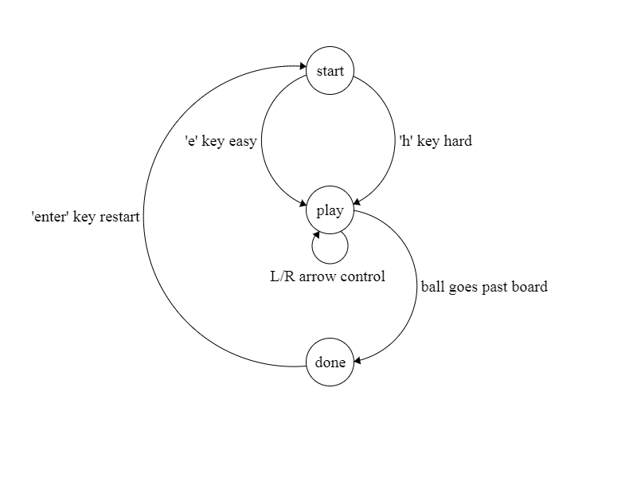

# Ball-rally
A retro style game done in Lua, using the love2d engine. A first attempt at game development. Exploring simple physics and game states.

# FSM of game states

# External Files used 
[push](https://github.com/Ulydev/push) - a library for handling resolution

[class](https://github.com/vrld/hump/blob/master/class.lua) - a library that simplifies object usage and method calling

[munro](http://www.tenbytwenty.com/#munro) - a pixelated font to recreate a retro vibe

# Releases
Windows [v1.0.4 zip](https://github.com/deoliang/ball-rally/releases/download/v1.0.4/ball-rally.zip) file, unzip and run ball-rally.exe to play
# To-do
- Commenting code
- Updating readme(rules, usage, images etc.)
- Possible deployment to server

# Reference
[Lecture 0 - CS50's Introduction to Game Development](https://www.youtube.com/watch?v=GfwpRU0cT10)

[Love2d](https://love2d.org/wiki/Main_Page)

